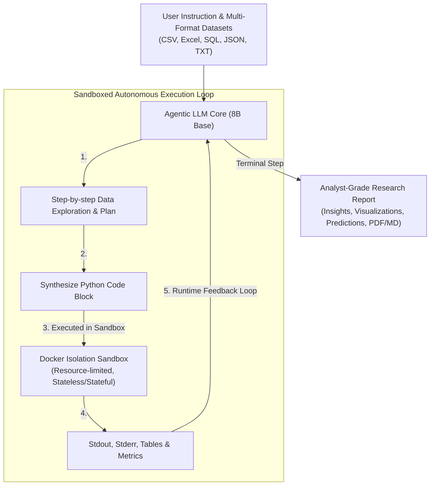
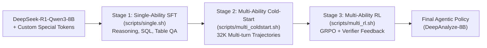

# Agentic LLM for Autonomous Data Science

[](https://www.python.org/downloads/)
[](https://github.com/Vaibhava2711/Agentic-LLM-for-Autonomous-Data-Science)
[](https://github.com/vllm-project/vllm)
[](https://github.com/Vaibhava2711)

> **An end-to-end autonomous agentic system designed to complete complex data science workflows without human intervention.**
> Powered by a fine-tuned 8B reasoning model with a typed action space, sandboxed execution loop, curriculum-driven training, and multi-modal serving interfaces.

---

## 🌟 Key Highlights & Innovations

- 🧠 **Typed Action Space (`<Analyze>`, `<Code>`, `<Execute>`)**:
  Eliminates rigid, brittle DAG workflows and hard-coded agent pipelines. The model operates within a native, typed action space that dynamically alternates between chain-of-thought analysis, executable Python synthesis, and execution feedback until reaching a terminal `<Answer>`.
- 🔒 **Closed Sandboxed Execution Loop**:
  Built-in Docker container isolation with CPU/RAM resource governance, strict security profiles, and automatic session cleanup to execute generated code securely against user datasets.
- 🎓 **3-Stage Curriculum Training**:
  1. **Stage 1 (Single-Ability SFT)**: Foundational data manipulation, table QA, code synthesis, and structured reasoning.
  2. **Stage 2 (Multi-Ability Cold-Start)**: Multi-turn trajectory supervision with extended context (up to 32K tokens).
  3. **Stage 3 (Multi-Ability Reinforcement Learning)**: Policy optimization via GRPO (Group Relative Policy Optimization) with execution verifiers and reward modeling.
- ⚡ **High-Throughput, Low-Memory Serving**:
  Fine-tuned on `DeepSeek-R1-0528-Qwen3-8B` and served through **vLLM**. Supports 4-bit NF4 weight quantization and FP8 KV Cache, allowing full execution on GPUs with as little as 16GB VRAM up to 131K context on larger hardware.
- 🖥 **Unified Interfaces**:
  Native support for **WebUI (v1 & v2)**, **JupyterLab integration**, **Rich CLI**, and an **OpenAI-compatible REST API**.

---

## 🏗 System Architecture



---

## 📁 Repository Structure

```
.
├── API/                   # OpenAI-compatible FastAPI REST server and endpoint routing
├── deepanalyze.py         # Core Agentic execution loop and vLLM client
├── deepanalyze/
│   ├── add_vocab.py       # Custom token embeddings injection (<Analyze>, <Code>, etc.)
│   ├── ms-swift/          # Full fine-tuning framework (Single-ability & Cold-start SFT)
│   └── SkyRL/             # Reinforcement learning framework (GRPO trainer & verifiers)
├── demo/
│   ├── chat/              # WebUI v1 (Next.js frontend + Python backend)
│   ├── chat_v2/           # WebUI v2 (DA-Studio with Docker sandbox isolation)
│   ├── cli/               # Rich-based interactive terminal client (Streaming output)
│   └── jupyter/           # JupyterLab MCP integration
├── docker/                # Dockerfiles and compose setups for isolated code execution
├── example/               # End-to-end case studies (Medicine, Student Loans, etc.)
├── playground/            # Evaluation benchmarks (DSBench, TableQA, DABStep)
├── quantize.py            # BitsAndBytes 4-bit (NF4) & 8-bit model quantizer
├── requirements.txt       # Core dependencies
├── run.py                 # Direct programmatic inference runner
└── scripts/               # 3-Stage training automation scripts
    ├── single.sh          # Stage 1: Single-ability SFT
    ├── multi_coldstart.sh # Stage 2: Multi-ability Cold-start SFT
    └── multi_rl.sh        # Stage 3: Multi-ability RL with GRPO
```

---

## 🚀 Quick Start

### 1. Environment Setup

```bash
# Create conda environment
conda create -n deepanalyze python=3.12 -y
conda activate deepanalyze

# Install dependencies
pip install -r requirements.txt
```

### 2. Model Serving via vLLM

The model can be launched with full precision, 8-bit, or 4-bit quantization with FP8 KV cache depending on your hardware:

| GPU Memory | Configuration | Recommended Max Length | FP8 KV Cache |
| :--- | :--- | :--- | :---: |
| **16 GB** | 4-bit Quantized | 49,152 |  Yes |
| **24 GB** | 4-bit Quantized | 131,072 |  Yes |
| **24 GB** | 8-bit Quantized | 98,304 |  Yes |
| **40 GB / 80 GB** | Original Model | 131,072 | Optional |

#### Launch vLLM Server:
```bash
python -m vllm.entrypoints.openai.api_server \
  --model /path/to/DeepAnalyze-8B \
  --served-model-name DeepAnalyze-8B \
  --max-model-len 49152 \
  --gpu-memory-utilization 0.95 \
  --port 8000 \
  --kv-cache-dtype fp8 \
  --trust-remote-code
```

*(To quantize the base weights to 4-bit NF4, use `python quantize.py --model_path <path> --output_path <path> --bits 4`)*.

---

## 🖥 Interfaces

### 1. Interactive CLI
Launch the real-time streaming terminal client:
```bash
# Terminal 1: Start API bridge
python API/start_server.py

# Terminal 2: Start CLI client
python demo/cli/api_cli.py
```

### 2. WebUI (DA-Studio with Docker Sandbox)
Launch the full web workspace featuring session management and containerized execution:
```bash
cd demo/chat_v2/frontend
npm install
cd ..
cp .env.example .env
bash start.sh
```
Access the application at `http://localhost:3000`.

### 3. JupyterLab Integration
Integrates directly with Jupyter Notebooks, automatically rendering model reasoning as Markdown cells and executable blocks as interactive Code cells:
```bash
cd demo/jupyter
pip install -e .
jupyter lab
```

### 4. OpenAI-Compatible API
The REST API allows drop-in integration with existing LLM tools:
```bash
# Upload a dataset
FILE_ID=$(curl -s -X POST "http://localhost:8200/v1/files" \
    -F "file=@data.csv" \
    -F "purpose=file-extract" | jq -r '.id')

# Query the agent
curl -X POST http://localhost:8200/v1/chat/completions \
     -H "Content-Type: application/json" \
     -d "{
        \"model\": \"DeepAnalyze-8B\",
        \"messages\": [
          {\"role\": \"user\", \"content\": \"Perform exploratory data analysis and output insights.\", \"file_ids\": [\"$FILE_ID\"]}
        ]
      }"
```

---

## 🧪 Training & Curriculum

The agent is trained using a structured 3-stage curriculum:



### 1. Add Custom Token Vocabulary
Inject the typed action tokens (`<Analyze>`, `<Code>`, `<Execute>`, `<Answer>`) into the base tokenizer:
```bash
python deepanalyze/add_vocab.py \
  --model_path /path/to/DeepSeek-R1-0528-Qwen3-8B \
  --save_path /path/to/DeepSeek-R1-addvocab \
  --add_tags
```

### 2. Run Curriculum Stages
```bash
# Stage 1: Single-ability Fine-tuning (DeepSpeed ZeRO-3)
bash scripts/single.sh

# Stage 2: Multi-ability Cold-Start (Long-context interaction traces)
bash scripts/multi_coldstart.sh

# Stage 3: Reinforcement Learning (GRPO with SkyRL & vLLM)
bash scripts/multi_rl.sh
```

---

## 📊 Benchmarks & Evaluation

Evaluation scripts for prominent data science and table QA benchmarks are unified under [`playground/`](./playground):
- **DSBench**: Data modeling, analysis, and data preparation benchmarks.
- **TableQA**: Tests across WikiSQL, WikiTQ, FeTaQA, FinQA, and HiTab.
- **DABStep**: Multi-step data reasoning and question answering.

To run an evaluation:
```bash
cd playground/DSBench/data_analysis
python run_deepanalyze.py
```

---

## 👤 Author

**Vaibhav Goyal**
- GitHub: [@Vaibhava2711](https://github.com/Vaibhava2711)
- Project Repository: [Agentic-LLM-for-Autonomous-Data-Science](https://github.com/Vaibhava2711/Agentic-LLM-for-Autonomous-Data-Science)
